# https://mermaideditor.com/ru/diagrams

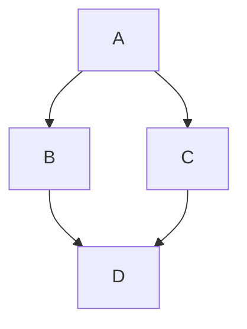
```mermaid
graph TD;
    A-->B;
    A-->C;
    B-->D;
    C-->D;
```

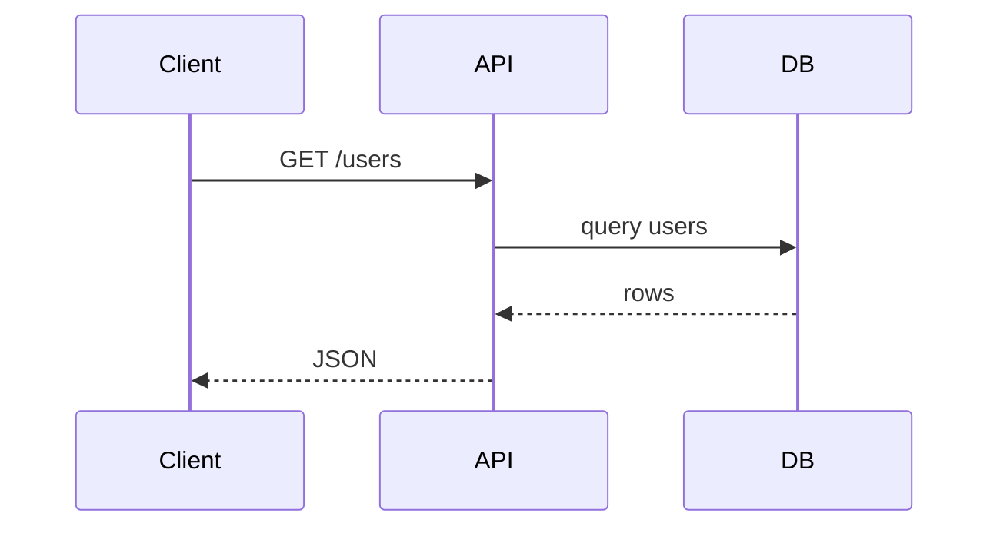
```mermaid
sequenceDiagram
    participant Client
    participant API
    participant DB
    Client->>API: GET /users
    API->>DB: query users
    DB-->>API: rows
    API-->>Client: JSON
```

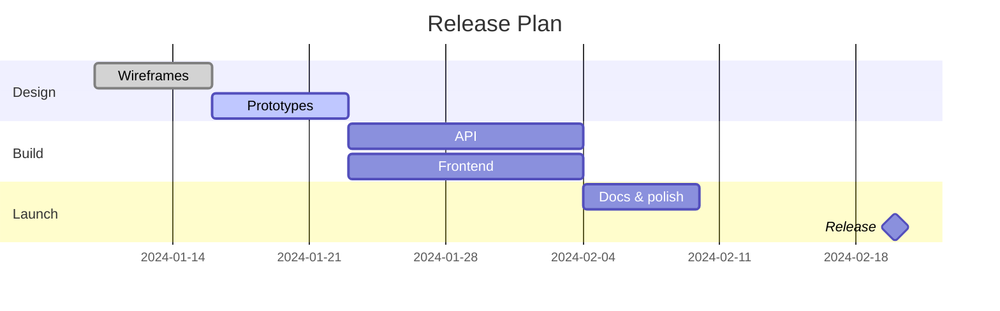
```mermaid
gantt
    title Release Plan
    dateFormat  YYYY-MM-DD
    section Design
    Wireframes           :done,    d1, 2024-01-10, 6d
    Prototypes           :active,  d2, after d1, 7d
    section Build
    API                  :d3, after d2, 12d
    Frontend             :d4, after d2, 12d
    section Launch
    Docs & polish        :d5, after d3, 6d
    Release              :milestone, 2024-02-20, 0d
```

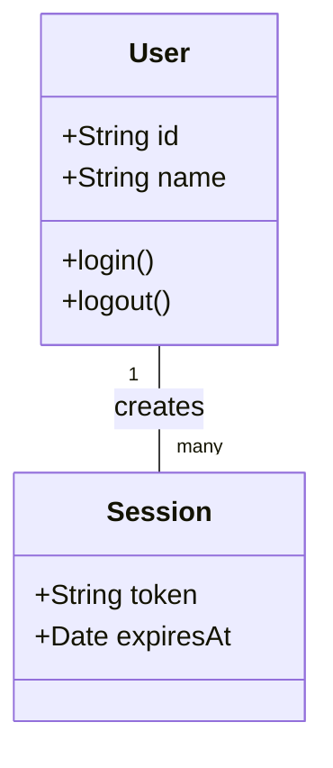
```mermaid
classDiagram
    class User {
      +String id
      +String name
      +login()
      +logout()
    }
    class Session {
      +String token
      +Date expiresAt
    }
    User "1" -- "many" Session : creates
```

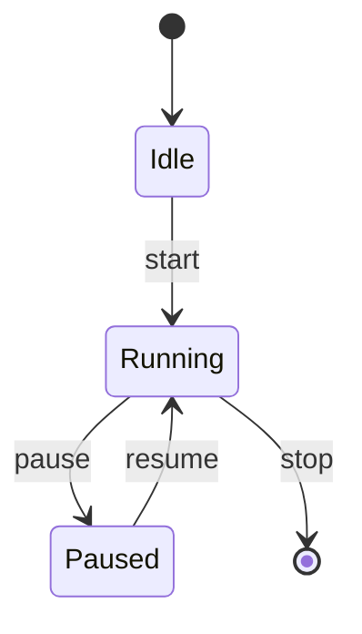
```mermaid
stateDiagram-v2
    [*] --> Idle
    Idle --> Running: start
    Running --> Paused: pause
    Paused --> Running: resume
    Running --> [*]: stop
```

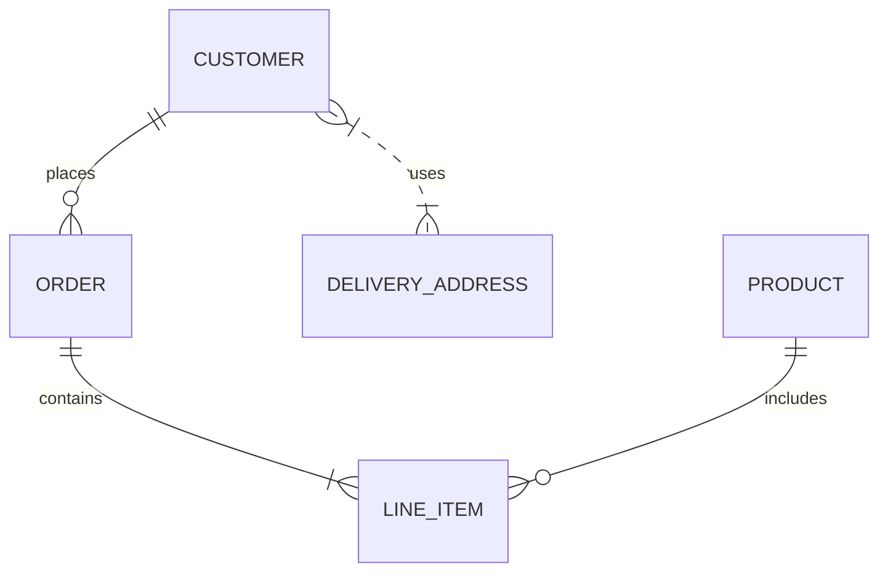
```mermaid
erDiagram
    CUSTOMER ||--o{ ORDER : places
    ORDER ||--|{ LINE_ITEM : contains
    CUSTOMER }|..|{ DELIVERY_ADDRESS : uses
    PRODUCT ||--o{ LINE_ITEM : includes
```

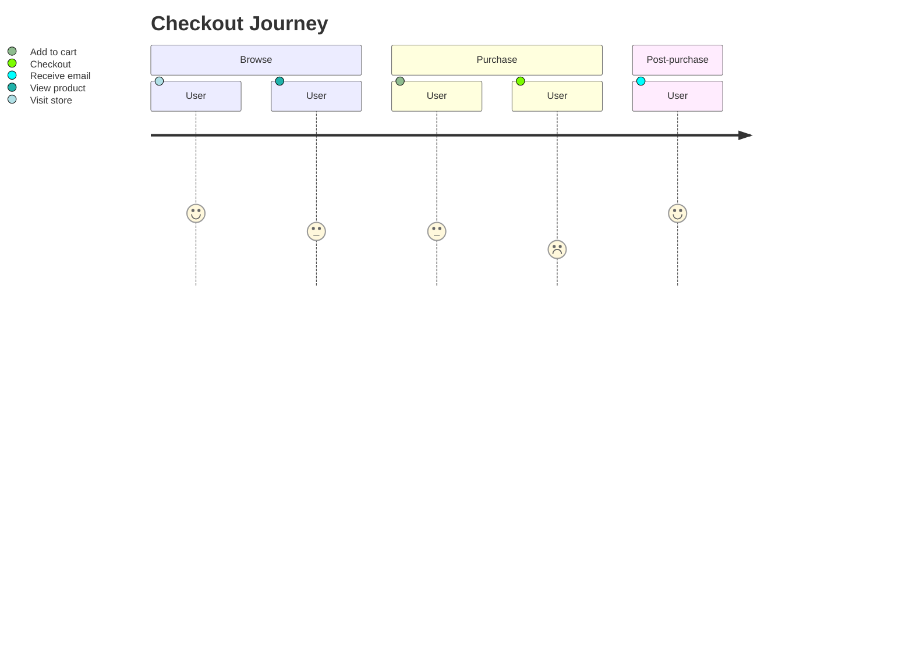
```mermaid
journey
    title Checkout Journey
    section Browse
      User: 4: Visit store
      User: 3: View product
    section Purchase
      User: 3: Add to cart
      User: 2: Checkout
    section Post-purchase
      User: 4: Receive email
```

```mermaid
gitGraph LR
      commit
      branch feature/login
      checkout feature/login
      commit
      checkout main
      merge feature/login
      commit
```

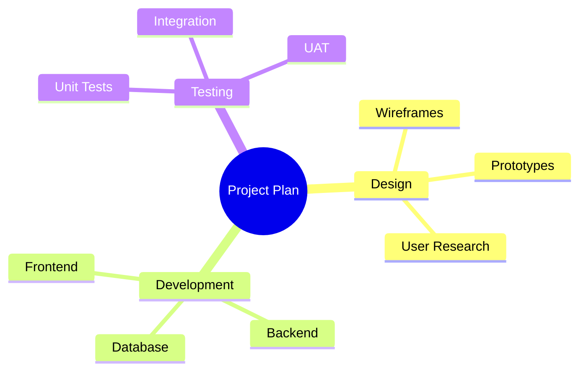
```mermaid
mindmap
  root((Project Plan))
    Design
      Wireframes
      Prototypes
      User Research
    Development
      Frontend
      Backend
      Database
    Testing
      Unit Tests
      Integration
      UAT
```

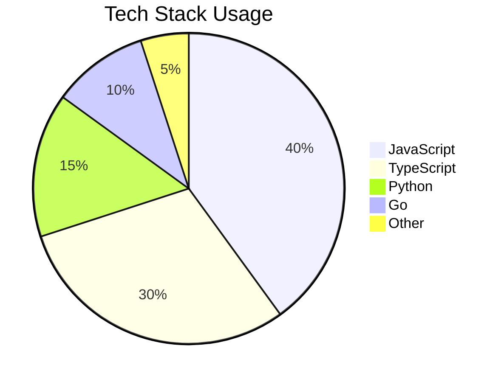
```mermaid
pie title Tech Stack Usage
    "JavaScript" : 40
    "TypeScript" : 30
    "Python" : 15
    "Go" : 10
    "Other" : 5
```

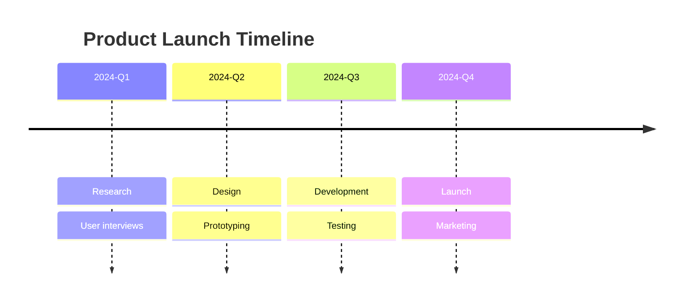
```mermaid
timeline
    title Product Launch Timeline
    2024-Q1 : Research
             : User interviews
    2024-Q2 : Design
             : Prototyping
    2024-Q3 : Development
             : Testing
    2024-Q4 : Launch
             : Marketing
```

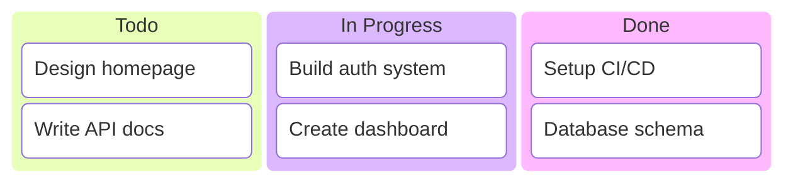
```mermaid
kanban
  Todo
    Design homepage
    Write API docs
  In Progress
    Build auth system
    Create dashboard
  Done
    Setup CI/CD
    Database schema
```

```mermaid
kanban
  Todo
    Design homepage
    Write API docs
  In Progress
    Build auth system
    Create dashboard
  Done
    Setup CI/CD
    Database schema
```

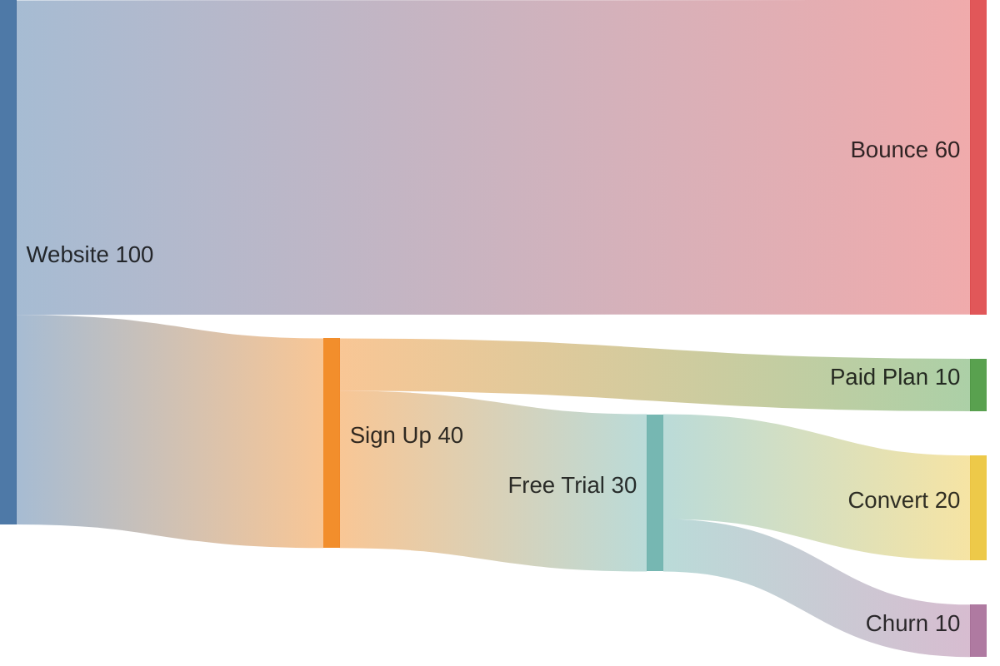
```mermaid
sankey-beta

Website,Sign Up,40
Website,Bounce,60
Sign Up,Free Trial,30
Sign Up,Paid Plan,10
Free Trial,Convert,20
Free Trial,Churn,10
```

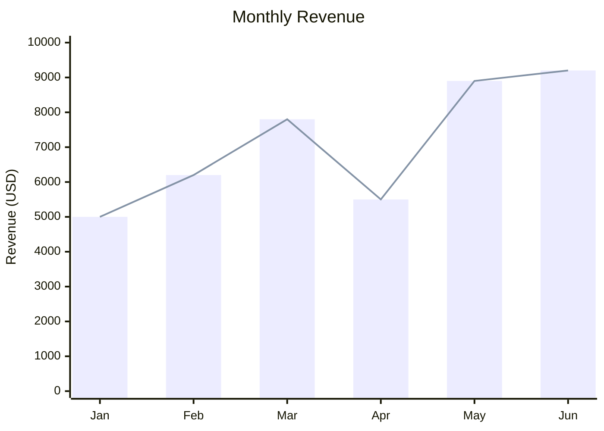
```mermaid
xychart-beta
    title "Monthly Revenue"
    x-axis [Jan, Feb, Mar, Apr, May, Jun]
    y-axis "Revenue (USD)" 0 --> 10000
    bar [5000, 6200, 7800, 5500, 8900, 9200]
    line [5000, 6200, 7800, 5500, 8900, 9200]
```

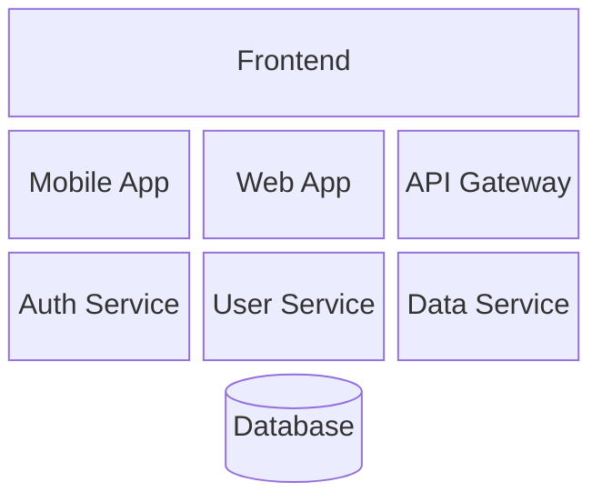
```mermaid
block-beta
columns 3
  Frontend:3
  columns 3
  App["Mobile App"] Web["Web App"] API["API Gateway"]
  columns 3
  Auth["Auth Service"] Users["User Service"] Data["Data Service"]
  columns 3
  DB[("Database")]:3
```

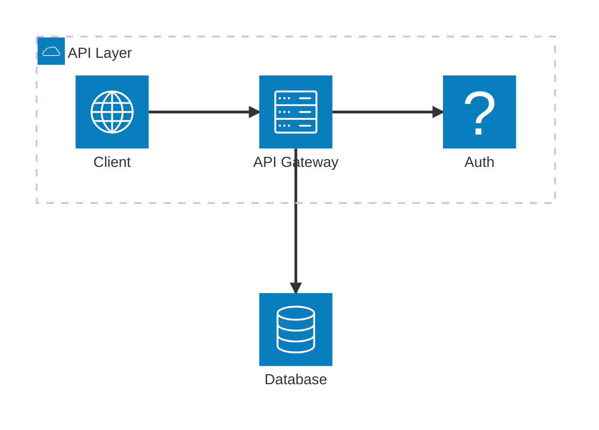
```mermaid
architecture-beta
    group api(cloud)[API Layer]

    service client(internet)[Client] in api
    service gateway(server)[API Gateway] in api
    service auth(lock)[Auth] in api
    service db(database)[Database]

    client:R --> L:gateway
    gateway:R --> L:auth
    gateway:B --> T:db
```

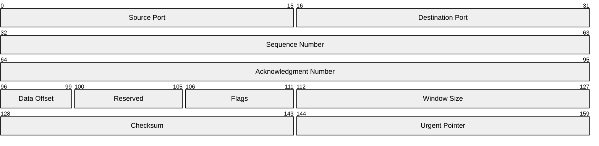
```mermaid
packet-beta
  0-15: "Source Port"
  16-31: "Destination Port"
  32-63: "Sequence Number"
  64-95: "Acknowledgment Number"
  96-99: "Data Offset"
  100-105: "Reserved"
  106-111: "Flags"
  112-127: "Window Size"
  128-143: "Checksum"
  144-159: "Urgent Pointer"
```

```mermaid

```

```mermaid

```